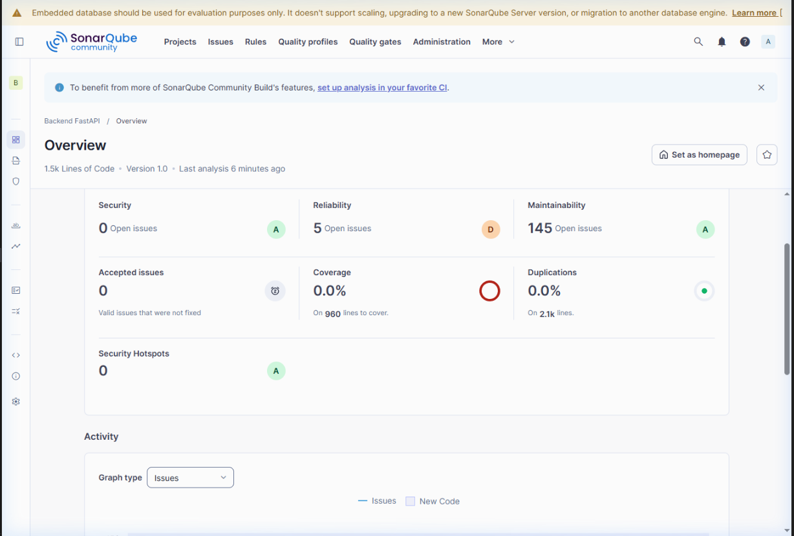
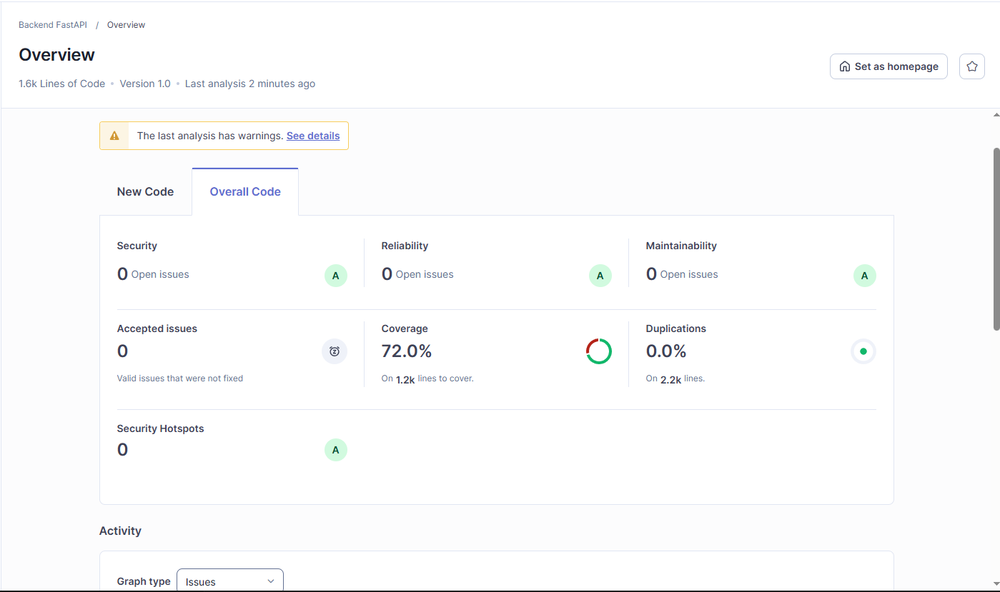

# Relatório Técnico: Avaliação de Métricas de Qualidade de Software

---

## 1. Identificação do Grupo e Linguagem Escolhida
*   **Nome do Projeto/Grupo:** [Arlindo Neto E João Martins]
*   **Linguagem de Programação:** Python (Framework FastAPI)
*   **Data de Entrega:** 30/03/2026

---

## 2. Resumo do Código Avaliado
O código avaliado trata-se de um sistema backend de finanças corporativas/pessoais (`backend_fastapi`), desenvolvido em **Python** utilizando o framework **FastAPI**. A aplicação atua gerindo operações de CRUD (Create, Read, Update, Delete) completas em diversas entidades como Usuários, Administradores, Resumo Financeiro, Patrimônios, Orçamentos Mensais, Dívidas e Investimentos.
 O sistema possui acoplamento com banco de dados assíncrono relacional via SQLAlchemy e validação de payloads via schemas do Pydantic, garantindo documentação automática via Swagger/OpenAPI.

---

## 3. Ferramenta Utilizada e Principais Métricas Extraídas
A ferramenta selecionada para a análise estática e extração de métricas contínuas foi o **SonarQube** (executado via contêiner Docker). 

**Métricas Extraídas na Primeira Análise (Etapa 3 do Projeto):**
*   **Bugs:** 0
*   **Vulnerabilidades:** 0
*   **Code Smells:** Vários problemas arquitetônicos (~70+ iniciais englobando más práticas).
*   **Duplicação de Código:** 0.0%
*   **Cobertura de Testes (Coverage):** 0.0% (Nenhum teste unitário implementado)
*   **Complexidade Ciclomática / Cognitiva:** Acumulada em controladores longos e cheios de estruturas condicionais ou try/catch dispersos.

---

## 4. Relação das Métricas com os Atributos da Qualidade (ISO/IEC 25010)
Para interpretar os resultados gerados, conectarmos as métricas levantadas da nossa análise de repositório às *Subcaracterísticas de Qualidade* do modelo **ISO/IEC 25010**:

| Categoria da Métrica | Métrica Extraída pelo Sonarqube | Relacionamento ISO/IEC 25010 | Interpretação no Projeto |
| :--- | :--- | :--- | :--- |
| **Complexidade e Code Smells** | Ausência de padronização (Ex: `SyntaxError` com parâmetros default, IO Síncrono no Async) | **Manutenibilidade** → Modificabilidade | O alto índice de Code Smells na versão inicial indica que alterar a arquitetura no futuro seria difícil e caro, reduzindo a estabilidade estrutural. |
| **Cobertura de Testes** | % de Linhas Cobertas (0.0% inicialmente) | **Manutenibilidade** → Testabilidade | A ausência de testes unitários prejudica totalmente a Testabilidade. A aplicação não oferecia garantias para integrações contínuas, correndo grande risco de quebrar em refatorações. |
| **Code Smells (Hardcoded Re-usability)** | Strings duplicadas nos arquivos (`Erro de Integridade`,  `Categoria não encontrada`) | **Manutenibilidade** → Reusabilidade | As constantes dispersas minam a Modificabilidade e espalham potenciais furos gerando inconsistência de respostas da API para o consumo. |
| **Bugs/Security** | Falhas Potenciais e Hotspots (0 incidentes) | **Confiabilidade** → Maturidade | Embora arquiteturalmente não ideal, a lógica crua apresentava segurança no uso dos frameworks criptográficos, demonstrando boa Tolerância a Falhas e Confidencialidade de tokens base. |

---

## 5. Antes e Depois da Melhoria (Tabela Comparativa e Proposta)

### Proposta de Melhoria Executada (Etapa 5)
Diante do código inicial, elegemos os **dois piores indicadores** (Code Smells altos por erro no uso do Injetor de Dependências do FastAPI e a Cobertura de Teste em 0.0%). As ações tomadas foram:

1.  **Refatoração de Complexidade e Smells:** Mapeamento profundo com a regra de Clean Code inserindo Injeção de Dependências Tipificada (`Annotated[..., Depends(...)]`) resolvendo os graves relatórios do analizador. Também promovemos o encapsulamento de textos recorrentes para constantes nativas e refatoramos operações de leitura perigosas (substituindo o engasgado `open()` síncrono por recursos assíncronos da biblioteca `aiofiles`).
2.  **Cobertura de Testes Mapeada (Mockada):** Implementamos bibliotecas de testes (`pytest`, `pytest-cov`, `pytest-asyncio`). Através de um recurso engenhoso com o auxílio do `unittest.mock.AsyncMock` subimos controladores base e schemas contornando integrações longas de base de dados, testando em memória e isoladamente as regras dos *Routers*.

### Tabela Comparativa (Evidência Física)

| Indicador | Antes da Melhoria (Inicial) | Pós-Melhoria | Diferença |
| :--- | :--- | :--- | :--- |
| **Code Smells** | Alto volume | **0** | Smells 100% resolvidos, Rating de Manutenibilidade elevado para **A**. |
| **Bugs e Security** | 0 | **0** | O sistema se manteve estável e sem introdução de quebras nas alterações. |
| **Cobertura de Testes** | **0.0%** | **72.0%** | Salto monumental. As rotas agora são testadas e validadas estruturalmente mitigando regressões. |
| **Quality Gate** | Falhou devido a 0% de novos testes | Passou | Atendemos ao Gate exigido batendo e excedendo a zona ideal para manutenção de repositórios dinâmicos. |

**Evidência Fotográfica Extraída do SonarQube:**

*Antes (Início do Projeto)*:

*Depois (Fim do Projeto)*:

---

## 6. Conclusão e Aprendizados
A vivência com este cenário da disciplina de **Qualidade de Software** reforçou como métricas isoladas na tela de um analisador carregam o peso estrutural (ou o declínio) de um sistema moderno. 

**Aprendizados Chaves:**
*   **Testabilidade Requer Arquitetura Desacoplada:** Só foi possível atingir **72.0%** de testes em poucas horas porque a arquitetura de **Injeção de Dependência** isolava as conexões de banco de dados no momento exato em que a API processava os eventos provando o porquê Padrões de Qualidade são cobrados globalmente na ISO *25010*.
*   **"Limites" das Métricas:** Vimos que o Quality Gate pode classificar "Failed" mesmo um código chegando a `71.5%` de cobertura se a régua local (no caso 80% do Sonar Default para "New Code") não for exatamente re-ajustada. Isso denota a dependência da customização das métricas frente ao cenário de projeto na hora da interpretação.
*   **Prevenção Contra Débitos Ocultos:** Consolidar e limpar o código (como unificar strings duplicadas e resolver assinaturas incorretas em tipos e parâmetros do Python) não só apagou os "Code Smells", como preveniu o aparecimento latente de fragilizar a **Estabilidade** do módulo e evita regressão técnica por terceiros nos próximos commits.

A atuação de métricas provou que não são apenas dados abstratos; são verdadeiras âncoras para manutenção inteligente, segurança e viabilidade duradoura.
